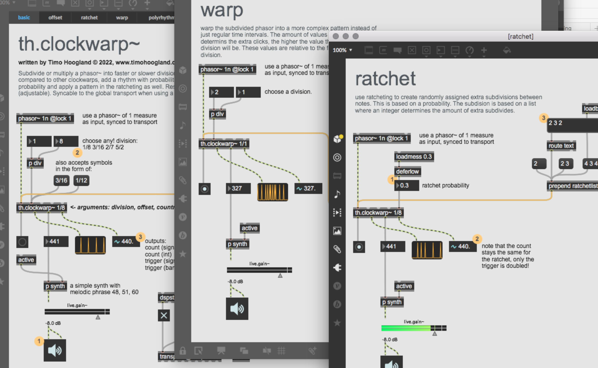

# th.clockwarp~

Create rhythms, subdivisions, probabilities and warping out of a single phasor~

## Support my projects

**Consider to [name a fair price](https://gumroad.com/tmhglnd)**

**Or [become a patron](https://patreon.com/timohoogland)**

**Or [support me on ko-fi](https://ko-fi.com/tmhglnd)**

---

## About

Subdivide or multiply a phasor~ into faster or slower divisions, apply an offset to the clock compared to other clockwarps using the same phasor (or when synced to transport), add a rhythmic pattern with probabilities, add a ratcheting effect with probability and apply a pattern in the ratcheting. Reset the counter every n-division (adjustable). Syncable to the global transport when using a [phasor~ 1n @lock 1]. This clock is the main clock for the [Mercury Live Coding Environment](https://github.com/tmhglnd/mercury)



## Features

- subdivide a phasor (eg. `1/8`, `3/16`, `2/7`)
- offset (delay) the phasor with subdivision (eg. `1/8`, `15/16`)
- add a percentage of swing to the off-beat
- reset the counter after n-division (eg. `2/1` = 2 bars)
- apply a list as rhythmic pattern with probabilities (eg. `1 0 0 1 0.3`)
- add a ratcheting effect with probability (some triggers are randomly doubled)
- apply a list as pattern for ratcheting multipliers (eg. `2 3 4` = double, triple, quadruple)
- apply a warping pattern to the subdivided phasor, allowing for more complex subdivisions.

## Reference

**arguments**
- `subdivision` - divide the phasor with a float or symbol (eg. `1/16`)
- `offset` - offset the clock with a float or symbol (eg. `1/8`)
- `countreset` - reset the note counter after n-division (eg. `1/1`), `0` means no reset and infinite count
- `ratchet` - set the ratchetting probability between 0-1 (default = 0)

**attributes**
- `@swing` - set the swing percentage for the off-beat
- `@hold` - hold division until next measure to set the new one.
- `@thresh` - Set the triggering threshold to reduce accidental triggers

**messages**
- `signal` - use incoming phasor to subdivide
- `beatlist` - a list of 1's and 0's representing a rhythmic pattern
- `ratchetlist` - a list of integer multipliers for ratcheting
- `warplist` - a list of integers as a warping pattern
- `swing` - set the swing percentage for the off-beat

## Install

```
1. download zip
2. unzip and place in Max Library (on MacOS ~/Documents/Max 9/Library)
3. restart Max9, open a new patcher
```
or
```
1. open terminal
2. $ cd ~/Documents/Max\ 9/Library
3. $ git clone https://github.com/tmhglnd/th.clockwarp.git
4. restart Max9, open a new patcher
```

# License

MIT License

This program is distributed in the hope that it will be useful

THE SOFTWARE IS PROVIDED "AS IS", WITHOUT WARRANTY OF ANY KIND, EXPRESS OR IMPLIED, INCLUDING BUT NOT LIMITED TO THE WARRANTIES OF MERCHANTABILITY, FITNESS FOR A PARTICULAR PURPOSE AND NONINFRINGEMENT. IN NO EVENT SHALL THE AUTHORS OR COPYRIGHT HOLDERS BE LIABLE FOR ANY CLAIM, DAMAGES OR OTHER LIABILITY, WHETHER IN AN ACTION OF CONTRACT, TORT OR OTHERWISE, ARISING FROM, OUT OF OR IN CONNECTION WITH THE SOFTWARE OR THE USE OR OTHER DEALINGS IN THE SOFTWARE.
